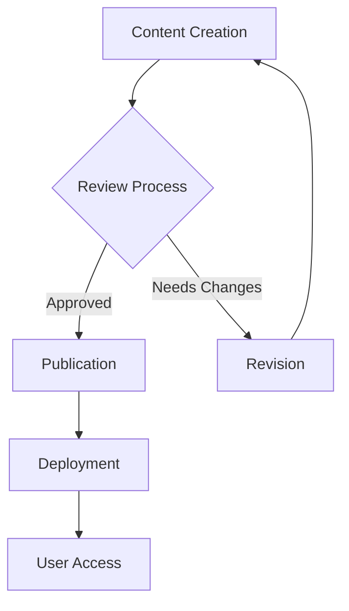
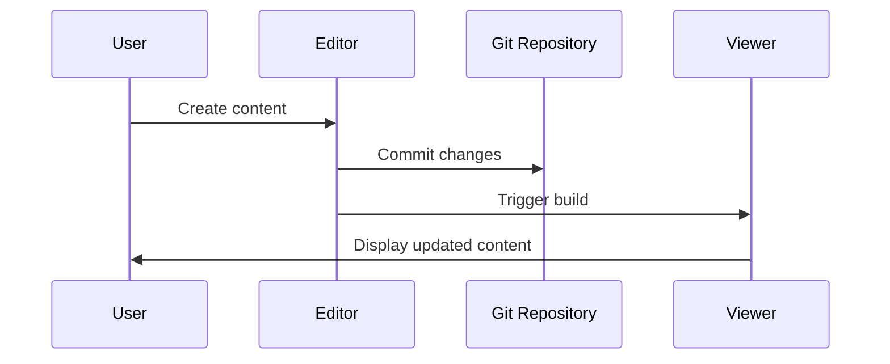

# Images and Media

Visual elements enhance documentation comprehension and user engagement. This section covers comprehensive media integration, optimization, and best practices for images, videos, and interactive content in BaiDocs.

## Image Integration

### Basic Image Syntax

```markdown


```

### Image Attributes and Sizing

```markdown
<!-- HTML syntax for advanced control -->


<!-- Responsive image with maximum width -->

```

### Image Positioning and Alignment

```markdown
<!-- Center-aligned image -->
<div style="text-align: center;">
  
</div>

<!-- Float image for text wrapping -->


This text wraps around the floating image, providing a magazine-style layout
for content that benefits from integrated visual elements alongside explanatory text.
```

## Advanced Image Features

### Responsive Images

```markdown
<!-- Multiple resolution support -->
<picture>
  <source media="(min-width: 800px)" srcset="./images/large-screenshot.png">
  <source media="(min-width: 400px)" srcset="./images/medium-screenshot.png">
  
</picture>
```

### Image Galleries and Comparisons

```markdown
<!-- Before/After comparison -->
<div style="display: flex; gap: 1rem; flex-wrap: wrap;">
  <div style="flex: 1; min-width: 300px;">
    <h4>Before Optimization</h4>
    
  </div>
  <div style="flex: 1; min-width: 300px;">
    <h4>After Optimization</h4>
    
  </div>
</div>
```

### Interactive Image Features

```markdown
<!-- Clickable image with zoom capability -->
<a href="./images/detailed-architecture.png" target="_blank" title="Click to view full size">
  
</a>

<!-- Image with caption -->
<figure>
  
  <figcaption>
    <strong>Figure 1:</strong> Complete documentation workflow from content creation
    to publication and maintenance
  </figcaption>
</figure>
```

## Video Integration

### Local Video Files

```markdown
<video controls width="100%" style="max-width: 800px;">
  <source src="./videos/feature-demonstration.mp4" type="video/mp4">
  <source src="./videos/feature-demonstration.webm" type="video/webm">
  <p>
    Your browser does not support video playback.
    <a href="./videos/feature-demonstration.mp4">Download the video</a>
    to view the demonstration.
  </p>
</video>
```

### External Video Embedding

```markdown
<!-- YouTube video embedding -->
<iframe width="560" height="315"
        src="https://www.youtube.com/embed/VIDEO_ID"
        title="BaiDocs Tutorial: Getting Started"
        frameborder="0"
        allow="accelerometer; autoplay; clipboard-write; encrypted-media; gyroscope; picture-in-picture"
        allowfullscreen>
</iframe>

<!-- Responsive video wrapper -->
<div style="position: relative; width: 100%; height: 0; padding-bottom: 56.25%;">
  <iframe src="https://www.youtube.com/embed/VIDEO_ID"
          title="Advanced BaiDocs Features"
          style="position: absolute; top: 0; left: 0; width: 100%; height: 100%;"
          frameborder="0"
          allowfullscreen>
  </iframe>
</div>
```

### Video with Fallback Content

```markdown
<video controls poster="./images/video-thumbnail.png" width="100%">
  <source src="./videos/tutorial.mp4" type="video/mp4">
  <source src="./videos/tutorial.webm" type="video/webm">

  <!-- Fallback content for browsers without video support -->
  <div style="text-align: center; padding: 2rem; background-color: #f5f5f5;">
    <h4>Video: BaiDocs Tutorial</h4>
    <p>This browser does not support video playback.</p>
    <p><a href="./videos/tutorial.mp4">Download video (MP4)</a></p>
    
  </div>
</video>
```

## Audio Content

### Audio File Integration

```markdown
<audio controls style="width: 100%;">
  <source src="./audio/pronunciation-guide.mp3" type="audio/mpeg">
  <source src="./audio/pronunciation-guide.ogg" type="audio/ogg">
  <p>
    Your browser does not support audio playback.
    <a href="./audio/pronunciation-guide.mp3">Download audio file</a>
  </p>
</audio>

<!-- Audio with transcript -->
<details>
<summary>Audio Transcript</summary>

**Speaker:** Welcome to the BaiDocs pronunciation guide. In this audio segment,
we'll cover the correct pronunciation of technical terms and concepts used
throughout the documentation.

**Term 1:** BaiDocs - pronounced "BYE-docs"
**Term 2:** MDX - pronounced "em-dee-ex"
**Term 3:** Monorepo - pronounced "MON-oh-rep-oh"

</details>
```

## Diagrams and Technical Illustrations

### SVG Graphics Integration

```markdown
<!-- Inline SVG for scalable diagrams -->
<svg width="400" height="200" viewBox="0 0 400 200" style="border: 1px solid #ccc;">
  <rect x="10" y="50" width="80" height="60" fill="#e3f2fd" stroke="#1976d2" stroke-width="2"/>
  <text x="50" y="85" text-anchor="middle" font-family="Arial" font-size="12">Editor</text>

  <rect x="160" y="50" width="80" height="60" fill="#f3e5f5" stroke="#7b1fa2" stroke-width="2"/>
  <text x="200" y="85" text-anchor="middle" font-family="Arial" font-size="12">Processor</text>

  <rect x="310" y="50" width="80" height="60" fill="#e8f5e8" stroke="#388e3c" stroke-width="2"/>
  <text x="350" y="85" text-anchor="middle" font-family="Arial" font-size="12">Viewer</text>

  <!-- Arrows connecting components -->
  <path d="M 90 80 L 160 80" stroke="#666" stroke-width="2" marker-end="url(#arrowhead)"/>
  <path d="M 240 80 L 310 80" stroke="#666" stroke-width="2" marker-end="url(#arrowhead)"/>

  <!-- Arrow marker definition -->
  <defs>
    <marker id="arrowhead" markerWidth="10" markerHeight="7" refX="10" refY="3.5" orient="auto">
      <polygon points="0 0, 10 3.5, 0 7" fill="#666"/>
    </marker>
  </defs>
</svg>

*Figure: BaiDocs content processing workflow*
```

### External Diagram Tools

```markdown
<!-- Mermaid diagram integration -->


<!-- Sequence diagram -->

````

## Asset Organization and Management

### Directory Structure for Media

```
images/
├── screenshots/
│   ├── editor-interface.png
│   ├── viewer-navigation.png
│   └── configuration-panel.png
├── diagrams/
│   ├── architecture-overview.svg
│   ├── workflow-process.svg
│   └── data-flow.svg
├── icons/
│   ├── feature-icons/
│   └── ui-elements/
└── logos/
    ├── company-logo.png
    ├── partner-logos/
    └── brand-assets/

videos/
├── tutorials/
│   ├── getting-started.mp4
│   ├── advanced-features.mp4
│   └── troubleshooting.mp4
└── demonstrations/
    ├── feature-demos/
    └── case-studies/

audio/
├── pronunciation-guides/
├── interviews/
└── podcasts/
```

### Image Optimization Guidelines

#### File Formats and Usage

| Format | Best Use Cases | Pros | Cons |
|--------|---------------|------|------|
| **PNG** | Screenshots, UI elements, transparent images | Lossless, transparency support | Large file sizes |
| **JPEG** | Photographs, complex images | Small file sizes, good compression | No transparency, lossy |
| **SVG** | Diagrams, logos, icons | Scalable, small file sizes | Limited browser support for complex graphics |
| **WebP** | Modern web images | Excellent compression, quality | Limited older browser support |

#### Optimization Techniques

```markdown
<!-- Optimized image with multiple formats -->
<picture>
  <source srcset="./images/feature-overview.webp" type="image/webp">
  <source srcset="./images/feature-overview.png" type="image/png">
  
</picture>
```

## Accessibility and Performance

### Alt Text Best Practices

```markdown
<!-- Descriptive alt text examples -->

✅ Good Alt Text:


❌ Poor Alt Text:


<!-- Decorative images -->
 <!-- Empty alt for decorative images -->

<!-- Complex diagrams with detailed descriptions -->

```

### Performance Optimization

#### Lazy Loading

```markdown

```

#### Progressive Image Enhancement

```markdown
<!-- Low-quality placeholder with progressive enhancement -->


<script>
// Progressive image loading implementation
document.addEventListener('DOMContentLoaded', function() {
    const images = document.querySelectorAll('.progressive-image');

    if ('IntersectionObserver' in window) {
        const imageObserver = new IntersectionObserver((entries, observer) => {
            entries.forEach(entry => {
                if (entry.isIntersecting) {
                    const img = entry.target;
                    img.src = img.dataset.src;
                    img.style.filter = 'none';
                    observer.unobserve(img);
                }
            });
        });

        images.forEach(img => imageObserver.observe(img));
    }
});
</script>
```

## Interactive Media Elements

### Image Annotations

```markdown
<div style="position: relative; display: inline-block;">
  

  <!-- Annotation points -->
  <div style="position: absolute; top: 20%; left: 10%; width: 20px; height: 20px;
              background-color: #ff4444; border-radius: 50%; border: 2px solid white;
              cursor: pointer;" title="Navigation Panel"></div>

  <div style="position: absolute; top: 30%; left: 60%; width: 20px; height: 20px;
              background-color: #44ff44; border-radius: 50%; border: 2px solid white;
              cursor: pointer;" title="Content Editor"></div>
</div>
```

### Image Carousels

```markdown
<div class="image-carousel" style="overflow-x: auto; white-space: nowrap; padding: 1rem 0;">
  
  
  
  
</div>
```

## Best Practices and Guidelines

### Content Quality Standards

#### Image Selection Criteria

- **Relevance**: Images must directly support content understanding
- **Quality**: High resolution and professional appearance
- **Consistency**: Uniform style and formatting across documentation
- **Accessibility**: Meaningful alt text and proper contrast ratios

#### Technical Standards

- **File size optimization**: Balance quality and loading performance
- **Format selection**: Choose appropriate formats for content type
- **Responsive design**: Ensure images work across all device sizes
- **Browser compatibility**: Test media elements across different browsers

### Legal and Ethical Considerations

#### Copyright and Licensing

```markdown
<!-- Proper image attribution -->
<figure>
  
  <figcaption>
    <strong>Figure 2:</strong> Open source collaboration workflow.
    Image licensed under <a href="https://creativecommons.org/licenses/by/4.0/">CC BY 4.0</a>.
    Original by <a href="https://example.com">Author Name</a>.
  </figcaption>
</figure>
```

#### Privacy and Permissions

- **Screen captures**: Ensure no sensitive information is visible
- **User consent**: Obtain permission for any user-generated content
- **Data protection**: Follow GDPR and other privacy regulations
- **Attribution requirements**: Provide proper credit for licensed content

Effective media integration enhances documentation usability while maintaining professional standards and accessibility compliance across all user devices and assistive technologies.