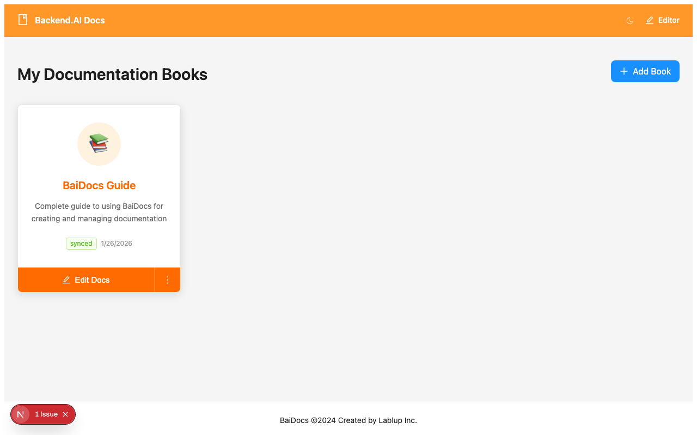
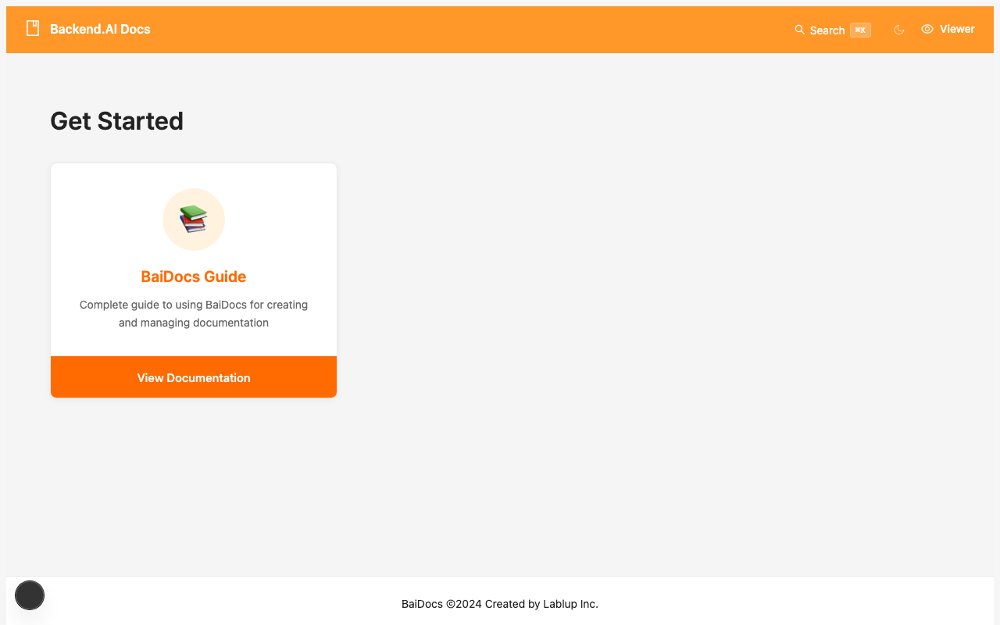

# Your First Book

Let's create your first documentation book with BaiDocs! This guide will walk you through the entire process, from creation to publication.

## Step 1: Access the Editor

First, make sure BaiDocs is running:

```bash
cd baidocs
pnpm dev
```

Open your browser and navigate to **http://localhost:3001**. You should see the BaiDocs Editor interface:


The Editor homepage shows:
- **Existing books** (if any)
- **Create New Book** button
- **Clone Repository** option
- **Import & Convert** tools

## Step 2: Create a New Book

Click the **"New Book"** button to start creating your documentation:


### Basic Information

Fill in the book details:

- **Book Name**: `my-first-book` (used as directory name)
- **Display Title**: `My First Documentation`
- **Description**: A brief description of your documentation
- **Emoji**: Choose an emoji to represent your book (optional)

### Language Configuration

- **Default Language**: `en` (English)
- **Additional Languages**: You can add more languages later

### Template Selection

Choose a starting template:

- **Empty**: Start with a minimal structure
- **Documentation**: Pre-built structure for technical docs
- **API Reference**: Template for API documentation
- **Tutorial**: Step-by-step guide template

### Git Configuration

Choose how to handle version control:

#### Option A: Local Git Repository

- **Git Type**: Local
- **Branch**: `main` (default)

This creates a local Git repository that you can connect to a remote later.

#### Option B: Remote Git Repository

- **Git Type**: Remote
- **Repository URL**: `https://github.com/your-username/my-docs.git`
- **Branch**: `main`

This connects directly to a remote repository (must exist).

## Step 3: Book Structure

Once created, your book will have this structure:

```
content/my-first-book/
├── book.config.yaml     # Book configuration
├── en/                  # English content
│   ├── index.mdx       # Homepage
│   ├── getting-started/
│   │   └── README.md   # Getting started guide
│   └── _assets/         # Asset directory
└── .git/               # Git repository (if enabled)
```

### Book Configuration

The `book.config.yaml` file controls your book's behavior:

```yaml
id: my-first-book
title: My First Documentation
description: A brief description of your documentation
emoji: 📚
type: document
branch: main
languages:
  - en
defaultLanguage: en
navigation:
  en:
    - title: "Home"
      path: "index.mdx"
    - title: "Getting Started"
      path: "getting-started/README.md"
```

## Step 4: Edit Your Content

### Navigate to Your Book

In the Editor, click on your newly created book to start editing:



The editor interface includes:

1. **File Explorer** (left sidebar): Navigate through your content files
2. **Editor Panel** (center): Write and edit content
3. **Preview Panel** (right): Live preview of your content
4. **Language Selector**: Switch between languages
5. **Save Button**: Save your changes

### Edit the Homepage

Click on `index.mdx` in the file explorer to edit your homepage:

```mdx
# Welcome to My First Documentation

This is the homepage of my documentation book created with BaiDocs.

## What's Inside

- **Getting Started**: Learn the basics
- **Advanced Topics**: Dive deeper into features
- **API Reference**: Detailed API documentation

## Features

BaiDocs provides:

- 📝 **Easy Writing**: Write in Markdown/MDX
- 🌍 **Multi-language**: Support for multiple languages
- 🔍 **Search**: Built-in search functionality
- 📱 **Responsive**: Works on all devices

Let's get started!
```

### Add New Content

Create a new page by:

1. Right-click in the file explorer
2. Select "New File"
3. Enter filename: `advanced-features.mdx`
4. Write your content:

```mdx
# Advanced Features

This page covers advanced features of our product.

## Configuration

You can configure the application using:

```yaml
# config.yaml
app:
  name: "My App"
  version: "1.0.0"
```

## API Integration

Connect to our API:

```javascript
const response = await fetch('/api/data');
const data = await response.json();
console.log(data);
```
```

### Update Navigation

Modify `book.config.yaml` to include your new page:

```yaml
navigation:
  en:
    - title: "Home"
      path: "index.mdx"
    - title: "Getting Started"
      path: "getting-started/README.md"
    - title: "Advanced Features"
      path: "advanced-features.mdx"
```

## Step 5: Preview Your Book

### In the Editor

Use the preview panel in the Editor to see how your content looks in real-time.

### In the Viewer

Open **http://localhost:3000** to see the public-facing version:



The Viewer shows:
- Clean, responsive design
- Navigation sidebar
- Search functionality
- Language switching
- Mobile-friendly layout

## Step 6: Save and Commit

### Save Your Changes

Click the **Save** button in the Editor to save all changes.

### Commit to Git

If you enabled Git, commit your changes:

```bash
cd content/my-first-book
git add .
git commit -m "Initial documentation setup"
```

### Push to Remote (if configured)

```bash
git push origin main
```

## Next Steps

Congratulations! You've created your first BaiDocs book. Here's what to explore next:

### Enhance Your Content

- **[Writing Guide](../writing/markdown-basics.mdx)**: Learn advanced Markdown/MDX features
- **[Admonitions](../writing/admonitions.mdx)**: Add callouts and special formatting
- **[Images & Assets](../writing/mdx-features.mdx)**: Include images and media

### Add Advanced Features

- **[Multi-language Support](../advanced/multilingual.mdx)**: Add translations
- **[Search Configuration](../advanced/search.mdx)**: Customize search behavior
- **[PDF Generation](../advanced/pdf-generation.mdx)**: Generate PDF versions

### Deployment

- **[Local Deployment](../deployment/local.mdx)**: Set up local hosting
- **[Vercel Deployment](../deployment/vercel.mdx)**: Deploy to the cloud

## Tips for Success

### Content Organization

- **Logical Structure**: Organize content in a logical hierarchy
- **Clear Navigation**: Use descriptive titles and logical grouping
- **Consistent Formatting**: Follow consistent formatting patterns

### Writing Best Practices

- **Clear Headers**: Use descriptive headers for navigation
- **Code Examples**: Include practical examples
- **Visual Elements**: Use images, diagrams, and callouts
- **Cross-references**: Link related content

### Maintenance

- **Regular Updates**: Keep content current and accurate
- **Git Workflow**: Use branches for major changes
- **Review Process**: Establish review workflows for team collaboration

---

*Your first book is ready! Start writing amazing documentation with BaiDocs.*