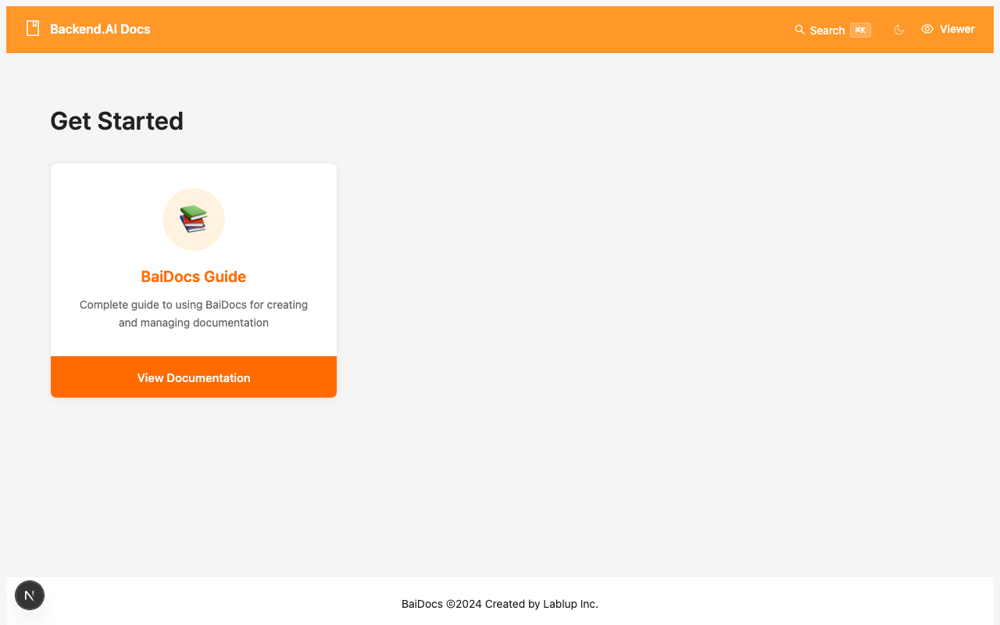

# Installation

Get BaiDocs up and running on your system in just a few minutes.

## Prerequisites

Before installing BaiDocs, make sure you have:

- **Node.js** 18.0 or later
- **Git** for version control
- **pnpm** (recommended) or npm/yarn

## Installation Methods

### Method 1: Clone from GitHub (Recommended)

The easiest way to get started is to clone the official BaiDocs repository:

```bash
# Clone the repository
git clone https://github.com/lablup/baidocs.git
cd baidocs

# Install dependencies
pnpm install

# Start the development servers
pnpm dev
```

This will start both applications:
- **Editor**: http://localhost:3001
- **Viewer**: http://localhost:3000

### Method 2: Use as Template

Create a new repository using BaiDocs as a template:

1. Visit [https://github.com/lablup/baidocs](https://github.com/lablup/baidocs)
2. Click "Use this template" → "Create a new repository"
3. Clone your new repository and install dependencies

```bash
git clone https://github.com/your-username/your-docs.git
cd your-docs
pnpm install
pnpm dev
```

## Development Scripts

BaiDocs provides several convenient scripts:

```bash
# Development (starts both apps)
pnpm dev

# Start Editor only
pnpm dev:editor

# Start Viewer only
pnpm dev:viewer

# Build for production
pnpm build

# Build Editor
pnpm build:editor

# Build Viewer
pnpm build:viewer
```

## Verify Installation

After starting the development servers, verify everything is working:

### 1. Check the Editor

Visit **http://localhost:3001** and you should see:


The Editor homepage shows all available books and provides options to:
- Create new books
- Clone existing repositories
- Import from other documentation tools

### 2. Check the Viewer

Visit **http://localhost:3000** and you should see:



The Viewer shows the public-facing documentation site with:
- List of all published books
- Search functionality
- Language switching
- Responsive design

## Configuration

BaiDocs works out of the box, but you can customize it:

### Environment Variables

Create `.env.local` files in the app directories:

```bash
# apps/editor/.env.local
NEXT_PUBLIC_APP_NAME="Your Docs Editor"

# apps/viewer/.env.local
NEXT_PUBLIC_APP_NAME="Your Documentation"
NEXT_PUBLIC_GITHUB_URL="https://github.com/your-org/docs"
```

### Content Directory

By default, BaiDocs looks for content in the `content/` directory. You can:

- Add new books by creating subdirectories
- Organize books however makes sense for your team
- Use Git repositories for individual books

## Troubleshooting

### Port Conflicts

If ports 3000 or 3001 are in use:

```bash
# Use custom ports
pnpm dev:editor --port 3002
pnpm dev:viewer --port 3003
```

### Permission Issues

On macOS/Linux, you might need to set permissions:

```bash
chmod +x scripts/*.sh
```

### Dependencies Issues

If you encounter dependency issues:

```bash
# Clear node modules and reinstall
rm -rf node_modules apps/*/node_modules
pnpm install
```

### Git Issues

Make sure Git is properly configured:

```bash
git config --global user.name "Your Name"
git config --global user.email "your.email@example.com"
```

## Next Steps

Now that BaiDocs is installed:

1. **[Create Your First Book](first-book.mdx)** - Start building documentation
2. **[Explore the Editor](../books/creating-books.mdx)** - Learn the interface
3. **[Write Content](../writing/markdown-basics.mdx)** - Master MDX syntax

## Development Setup

For contributors or advanced users who want to modify BaiDocs:

### Repository Structure

```
baidocs/
├── apps/
│   ├── editor/         # Editor Next.js app
│   └── viewer/         # Viewer Next.js app
├── packages/
│   └── ui/            # Shared components
├── content/           # Sample documentation
└── scripts/           # Build and utility scripts
```

### Contributing

1. Fork the repository
2. Create a feature branch
3. Make your changes
4. Test thoroughly
5. Submit a pull request

### Building from Source

```bash
# Full development build
pnpm build

# Watch mode for development
pnpm dev

# Run tests
pnpm test
```

---

*Installation complete! Ready to create amazing documentation with BaiDocs.*