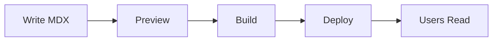

# What is BaiDocs?

BaiDocs is a **modern documentation framework** built with Next.js and React that makes it easy to create, manage, and publish beautiful technical documentation.

## The Problem BaiDocs Solves

Creating good documentation is hard. Traditional documentation tools often suffer from:

- 🚫 **Complex setup** - Too many configuration files and dependencies
- 🚫 **Limited customization** - Rigid themes that are hard to modify
- 🚫 **Poor developer experience** - Clunky editors and slow build times
- 🚫 **Vendor lock-in** - Proprietary formats that trap your content

BaiDocs addresses all of these issues.

## The BaiDocs Approach

BaiDocs is built on these core principles:

### 1. Content First

Your content is stored in **plain Markdown/MDX files** that you own completely. No proprietary formats, no databases, no lock-in.

```markdown
# Your Content
Just write in Markdown. It's that simple.
```

### 2. Powerful Yet Simple

BaiDocs uses MDX, which means you get:

- All the simplicity of Markdown
- The power of React components when you need them
- Syntax highlighting, tables, admonitions, and more

### 3. Modern Stack

Built with cutting-edge technologies:

| Technology | Purpose |
|------------|---------|
| **Next.js 15** | React framework with App Router |
| **React 19** | UI library |
| **TypeScript** | Type safety |
| **pnpm** | Fast, efficient package management |
| **Ant Design** | Beautiful UI components |

### 4. Flexible Architecture

BaiDocs consists of two main applications:

```
BaiDocs
├── 📝 Editor (Port 3001)
│   └── WYSIWYG editing interface
└── 👁️ Viewer (Port 3000)
    └── Beautiful documentation website
```

## Key Concepts

### Books

In BaiDocs, documentation is organized into **books**. Each book:

- Lives in its own directory
- Has independent configuration
- Can support multiple languages
- Can be versioned separately

### Content Directory

All your books live in the `content/` directory:

```
content/
├── my-api-docs/
├── user-guide/
└── developer-handbook/
```

### Configuration

Each book has a simple YAML configuration:

```yaml
id: my-book
title: My Awesome Documentation
languages:
  - en
  - ko
```

:::note
BaiDocs can import documentation from GitBook, Sphinx, MkDocs, and other popular formats!
:::

## How It Works

Here's the BaiDocs workflow:

1. **Write** - Create content in Markdown/MDX files
2. **Preview** - See changes instantly with hot reload
3. **Build** - Generate a static site with search index and PDFs
4. **Deploy** - Host anywhere (Vercel, Netlify, your own server)



:::warning
Mermaid diagrams are shown as code blocks in the current version. Diagram rendering support is planned for future releases.
:::

## What Makes BaiDocs Special?

### 🎨 Beautiful by Default

Comes with carefully crafted themes that look professional out of the box.

### ⚡ Lightning Fast

Static site generation means your docs load instantly.

### 🔍 Powerful Search

Build-time search index with fuzzy matching. No external service needed.

### 📄 PDF Export

Automatically generate PDFs of your documentation during build.

### 🌍 Multi-language

First-class support for multilingual documentation.

### 🎭 Theme System

Choose from built-in themes or create your own with CSS variables.

## Comparison with Other Tools

| Feature | BaiDocs | GitBook | Docusaurus | MkDocs |
|---------|---------|---------|------------|--------|
| **Open Source** | ✅ | ❌ | ✅ | ✅ |
| **MDX Support** | ✅ | ❌ | ✅ | ❌ |
| **WYSIWYG Editor** | ✅ | ✅ | ❌ | ❌ |
| **PDF Export** | ✅ | ✅ (paid) | ❌ | ✅ |
| **Self-hosted** | ✅ | ✅ (paid) | ✅ | ✅ |
| **Theme System** | ✅ | ❌ | ✅ | ✅ |

## Real-World Use Cases

### API Documentation

Perfect for documenting REST APIs, SDKs, and libraries with code examples and interactive elements.

### User Guides

Create comprehensive user guides with screenshots, videos, and step-by-step instructions.

### Internal Wiki

Build an internal knowledge base for your team with search and multi-language support.

### Course Materials

Develop educational content with proper structure and PDF export for offline reading.

## Architecture Overview

BaiDocs uses a monorepo structure with pnpm workspaces:

```
baidocs/
├── apps/
│   ├── editor/    # Editing application
│   └── viewer/    # Documentation viewer
├── packages/
│   ├── ui/        # Shared components
│   └── config/    # Configuration utilities
└── content/       # Your documentation books
```

:::success
Each part of BaiDocs is designed to be modular and maintainable, making it easy to contribute and extend.
:::

## Next Steps

Now that you understand what BaiDocs is, let's explore its [Key Features](key-features.md) in more detail.
