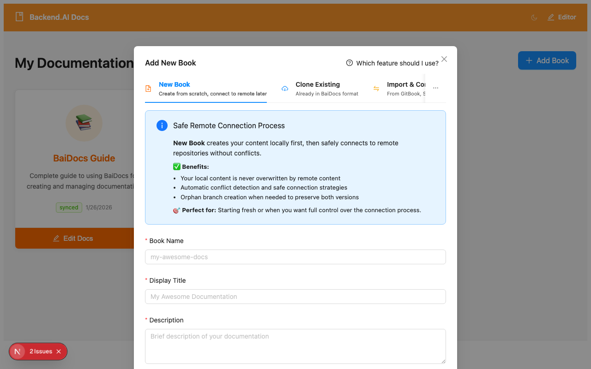

# 책 생성

BaiDocs는 다양한 워크플로우와 요구사항에 적합한 여러 가지 문서 책 생성 방법을 제공합니다.

## 새 책 생성

### 새 책 모달 접근

BaiDocs 에디터에서 홈페이지의 **"New Book"** 버튼을 클릭합니다:



### 기본 설정

#### 책 정보

- **Book Name**: 책의 디렉토리 이름 (예: `api-documentation`)
  - 소문자여야 하며 공백이 없어야 함
  - 단어 분리에 하이픈 사용
  - URL 경로가 됨

- **Display Title**: 사람이 읽기 쉬운 제목 (예: `API Documentation`)
  - 내비게이션과 페이지 제목에 표시됨
  - 공백과 특수 문자 포함 가능

- **Description**: 책의 목적에 대한 간단한 설명
  - 사용자가 책의 내용을 이해하는 데 도움
  - 검색 결과와 메타데이터에 사용됨

- **Emoji**: 책을 나타내는 선택적 이모지
  - 내비게이션을 더 시각적이고 기억하기 쉽게 만듦
  - 책 목록과 내비게이션에 표시됨

#### 언어 설정

- **Default Language**: 문서의 기본 언어
  - 일반적으로 `en` (영어)
  - 기본 콘텐츠 언어를 결정함

- **Additional Languages**: 나중에 더 많은 언어를 추가할 수 있음
  - 각 언어가 고유한 콘텐츠 디렉토리를 가짐
  - 내비게이션을 언어별로 번역할 수 있음

#### 템플릿 선택

문서 유형에 맞는 템플릿을 선택합니다:

- **Empty**: 최소한의 구조, 최대 유연성
- **Documentation**: 표준 기술 문서
- **API Reference**: API 문서를 위한 구조
- **Tutorial**: 단계별 가이드 형식

## Git 통합 옵션

BaiDocs는 Git 통합을 위한 세 가지 접근 방식을 제공합니다:

### 옵션 1: 로컬 Git 저장소

**적합한 경우**: 새 프로젝트, 로컬 개발, 점진적 도입

```
✅ 장점:
- 빠른 설정
- 외부 종속성 없음
- 완전한 로컬 제어
- 나중에 원격에 쉽게 연결

❌ 고려사항:
- 수동 백업 필요
- 내장 협업 기능 없음
- 나중에 원격 설정 필요
```

**설정**:
- **Git Type**: Local
- **Branch**: `main` (권장)

**진행 과정**:
1. 로컬 Git 저장소가 초기화됨
2. 초기 커밋이 생성됨
3. 작업 브랜치가 지정된 브랜치로 설정됨
4. 로컬 개발 준비 완료

### 옵션 2: 원격 저장소에 연결

**적합한 경우**: 기존 빈 저장소, 팀 협업

```
✅ 장점:
- 원격으로 즉시 백업
- 팀 협업 준비 완료
- CI/CD 통합 가능
- 버전 히스토리 보존

❌ 고려사항:
- 저장소가 존재하고 비어있어야 함
- Git 자격 증명 필요
- 네트워크 종속성
```

**설정**:
- **Git Type**: Remote
- **Repository URL**: `https://github.com/username/repo.git`
- **Branch**: `main` 또는 선호하는 브랜치

**전제 조건**:
- 빈 Git 저장소 존재
- 저장소에 대한 푸시 권한 보유
- Git 자격 증명 설정

**진행 과정**:
1. 로컬 콘텐츠가 생성됨
2. Git 저장소가 초기화됨
3. 원격 origin이 설정됨
4. 초기 커밋 및 원격으로 푸시

### 옵션 3: 먼저 생성 후 나중에 연결

**적합한 경우**: 불확실한 원격 설정, 실험적 프로젝트

```
✅ 장점:
- 즉시 시작 가능
- 사전 원격 설정 불필요
- 먼저 로컬에서 테스트
- 준비되면 연결

❌ 고려사항:
- 수동 원격 연결 필요
- 나중에 병합 충돌 가능성
- 추가 설정 단계
```

**과정**:
1. **Local** git 타입으로 책 생성
2. 로컬에서 콘텐츠 개발
3. 준비되면 원격 저장소 생성
4. 수동으로 로컬을 원격에 연결

## 나중에 로컬을 원격에 연결

로컬 저장소로 시작한 경우, 원격에 연결할 수 있습니다:

### 1단계: 원격 저장소 생성

GitHub, GitLab 또는 Git 제공업체에 빈 저장소를 생성합니다.

### 2단계: 원격 Origin 추가

```bash
cd content/your-book-name
git remote add origin https://github.com/username/repo.git
```

### 3단계: 원격에 푸시

```bash
git push -u origin main
```

### 4단계: 연결 확인

```bash
git remote -v
# 다음을 표시해야 함:
# origin  https://github.com/username/repo.git (fetch)
# origin  https://github.com/username/repo.git (push)
```

## 생성 후 책 구조

생성되면 책은 다음 구조를 갖습니다:

```
content/your-book/
├── book.config.yaml     # 책 설정
├── en/                  # 기본 언어 콘텐츠
│   ├── index.mdx       # 홈페이지
│   ├── getting-started/
│   │   └── README.md   # 시작하기 섹션
│   └── _assets/         # 이미지와 에셋
├── .git/               # Git 저장소 (활성화된 경우)
├── .gitignore          # Git 무시 규칙
└── README.md           # 저장소 문서
```

### book.config.yaml 이해하기

이 파일은 책의 동작과 메타데이터를 제어합니다:

```yaml
id: your-book
title: Your Book Title
description: Description of your documentation
emoji: 📚
type: document
branch: main
languages:
  - en
defaultLanguage: en
navigation:
  en:
    - title: "Home"
      path: "index.mdx"
    - title: "Getting Started"
      path: "getting-started/README.md"
```

**주요 설정 옵션**:

- `id`: 고유 식별자 (디렉토리 이름과 일치)
- `title`: 책의 표시 제목
- `description`: 간단한 설명
- `emoji`: 시각적 식별자
- `type`: 문서 유형 (`document`가 표준)
- `branch`: 기본 Git 브랜치
- `languages`: 지원되는 언어 배열
- `defaultLanguage`: 기본 언어
- `navigation`: 언어별 내비게이션 구조

## 고급 생성 옵션

### 환경별 책

다양한 환경(개발, 스테이징, 프로덕션)에 대해:

```yaml
# book.config.yaml
id: api-docs-dev
title: API Documentation (Development)
description: Development environment API docs
baseUrl: https://dev-api.example.com
```

### 다중 저장소 책

여러 저장소에 걸친 책의 경우:

```yaml
# book.config.yaml
externalSources:
  - name: "API Specs"
    repository: "https://github.com/company/api-specs.git"
    path: "docs/"
  - name: "SDK Examples"
    repository: "https://github.com/company/sdk-examples.git"
    path: "examples/"
```

### 사용자 정의 브랜치 전략

복잡한 브랜치 전략의 경우:

```yaml
# book.config.yaml
git:
  defaultBranch: main
  developmentBranch: develop
  branchPrefix: "docs/"
  autoMerge: false
```

## 모범 사례

### 명명 규칙

**책 이름**:
- kebab-case 사용: `api-documentation`
- 설명적으로 작성: `guide`가 아닌 `user-guide`
- 이름에 버전 포함하지 않기: `api-docs-v2`가 아닌 `api-docs`

**디렉토리 구조**:
```
getting-started/     # 좋음: 명확한 목적
basics/             # 좋음: 설명적
misc/               # 피할 것: 너무 모호
temp/               # 피할 것: 영구적이지 않음
```

### 콘텐츠 구성

**논리적 계층 구조**:
```
en/
├── index.mdx           # 항상 홈페이지 보유
├── getting-started/    # 여기서 시작하는 콘텐츠
├── user-guide/         # 사용법 정보
├── reference/          # 상세한 참조
├── advanced/           # 전문가 주제
└── troubleshooting/    # 문제 해결
```

### Git 워크플로우 통합

**팀용**:
- 주요 변경사항에 기능 브랜치 사용
- 풀 리퀘스트 리뷰 필수
- main 브랜치에서 자동 배포 설정
- 규약적 커밋 메시지 사용

**브랜치 보호**:
```bash
# main 브랜치 보호
git branch --set-upstream-to=origin/main main
```

## 문제 해결

### 일반적인 문제

**"Repository already exists"**:
- 저장소가 비어있지 않음
- 다른 저장소를 사용하거나 기존 저장소를 정리

**"Permission denied"**:
- Git 자격 증명 확인
- 저장소 액세스 권한 확인
- HTTPS가 실패하면 SSH 키 사용

**"Could not push to remote"**:
- 저장소가 비어있지 않을 수 있음
- 브랜치 이름이 일치하는지 확인
- 네트워크 연결성 확인

### 복구 단계

**다시 시작**:
```bash
rm -rf content/problematic-book
# 다른 설정으로 다시 생성
```

**원격 연결 수정**:
```bash
cd content/your-book
git remote set-url origin https://github.com/correct-url/repo.git
git push -u origin main
```

## 다음 단계

책을 생성한 후:

1. **[콘텐츠 작성](../writing/markdown-basics.mdx)**: MDX 문법과 기능을 학습합니다
2. **[내비게이션 설정](../advanced/multilingual.mdx)**: 내비게이션 구조를 설정합니다
3. **[언어 추가](../advanced/multilingual.mdx)**: 여러 언어를 지원합니다
4. **[배포](../deployment/local.mdx)**: 문서를 사용 가능하게 만듭니다

---

*책이 준비되었습니다! 훌륭한 콘텐츠로 채우기 시작하세요.*