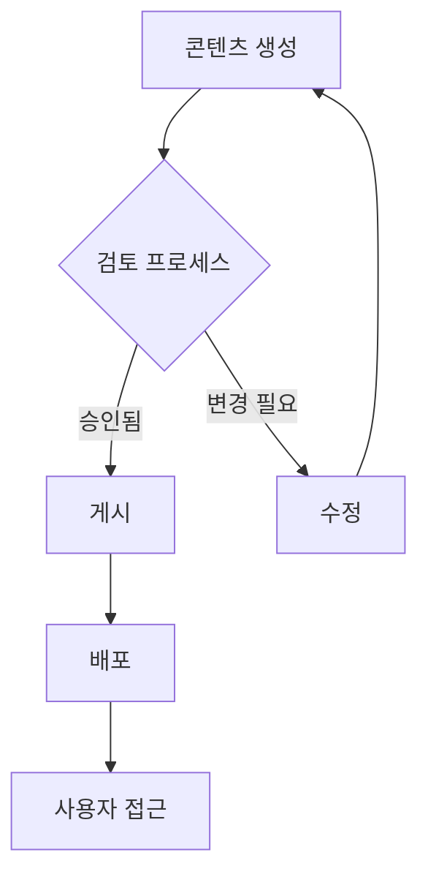
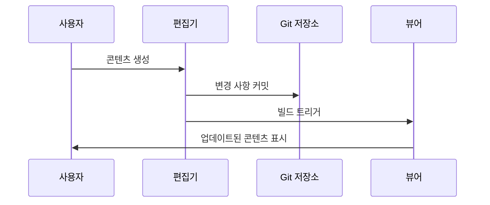

# 이미지와 미디어

시각적 요소는 문서 이해도와 사용자 참여를 향상시킵니다. 이 섹션에서는 BaiDocs에서 이미지, 비디오 및 상호 작용 콘텐츠를 포괄적으로 통합, 최적화하고 모범 사례를 다룹니다.

## 이미지 통합

### 기본 이미지 문법

```markdown


```

### 이미지 속성 및 크기 조정

```markdown
<!-- 고급 제어를 위한 HTML 문법 -->


<!-- 최대 너비가 있는 반응형 이미지 -->

```

### 이미지 위치 및 정렬

```markdown
<!-- 중앙 정렬 이미지 -->
<div style="text-align: center;">
  
</div>

<!-- 텍스트 랩핑을 위한 플로팅 이미지 -->


이 텍스트는 플로팅 이미지 주위로 감싸져서 설명 텍스트와 함께 통합된
시각적 요소의 혜택을 받는 콘텐츠에 잡지 스타일의 레이아웃을 제공합니다.
```

## 고급 이미지 기능

### 반응형 이미지

```markdown
<!-- 다중 해상도 지원 -->
<picture>
  <source media="(min-width: 800px)" srcset="./images/large-screenshot.png">
  <source media="(min-width: 400px)" srcset="./images/medium-screenshot.png">
  
</picture>
```

### 이미지 갤러리 및 비교

```markdown
<!-- 전/후 비교 -->
<div style="display: flex; gap: 1rem; flex-wrap: wrap;">
  <div style="flex: 1; min-width: 300px;">
    <h4>최적화 전</h4>
    
  </div>
  <div style="flex: 1; min-width: 300px;">
    <h4>최적화 후</h4>
    
  </div>
</div>
```

### 상호 작용 이미지 기능

```markdown
<!-- 확대 기능이 있는 클릭 가능한 이미지 -->
<a href="./images/detailed-architecture.png" target="_blank" title="전체 크기로 보려면 클릭">
  
</a>

<!-- 캡션이 있는 이미지 -->
<figure>
  
  <figcaption>
    <strong>그림 1:</strong> 콘텐츠 생성부터 게시 및 유지보수까지의
    완전한 문서화 워크플로
  </figcaption>
</figure>
```

## 비디오 통합

### 로컬 비디오 파일

```markdown
<video controls width="100%" style="max-width: 800px;">
  <source src="./videos/feature-demonstration.mp4" type="video/mp4">
  <source src="./videos/feature-demonstration.webm" type="video/webm">
  <p>
    브라우저가 비디오 재생을 지원하지 않습니다.
    <a href="./videos/feature-demonstration.mp4">비디오 다운로드</a>하여
    데모를 시청하십시오.
  </p>
</video>
```

### 외부 비디오 임베딩

```markdown
<!-- YouTube 비디오 임베딩 -->
<iframe width="560" height="315"
        src="https://www.youtube.com/embed/VIDEO_ID"
        title="BaiDocs 튜토리얼: 시작하기"
        frameborder="0"
        allow="accelerometer; autoplay; clipboard-write; encrypted-media; gyroscope; picture-in-picture"
        allowfullscreen>
</iframe>

<!-- 반응형 비디오 래퍼 -->
<div style="position: relative; width: 100%; height: 0; padding-bottom: 56.25%;">
  <iframe src="https://www.youtube.com/embed/VIDEO_ID"
          title="고급 BaiDocs 기능"
          style="position: absolute; top: 0; left: 0; width: 100%; height: 100%;"
          frameborder="0"
          allowfullscreen>
  </iframe>
</div>
```

### 대체 콘텐츠가 있는 비디오

```markdown
<video controls poster="./images/video-thumbnail.png" width="100%">
  <source src="./videos/tutorial.mp4" type="video/mp4">
  <source src="./videos/tutorial.webm" type="video/webm">

  <!-- 비디오 지원이 없는 브라우저를 위한 대체 콘텐츠 -->
  <div style="text-align: center; padding: 2rem; background-color: #f5f5f5;">
    <h4>비디오: BaiDocs 튜토리얼</h4>
    <p>이 브라우저는 비디오 재생을 지원하지 않습니다.</p>
    <p><a href="./videos/tutorial.mp4">비디오 다운로드 (MP4)</a></p>
    
  </div>
</video>
```

## 오디오 콘텐츠

### 오디오 파일 통합

```markdown
<audio controls style="width: 100%;">
  <source src="./audio/pronunciation-guide.mp3" type="audio/mpeg">
  <source src="./audio/pronunciation-guide.ogg" type="audio/ogg">
  <p>
    브라우저가 오디오 재생을 지원하지 않습니다.
    <a href="./audio/pronunciation-guide.mp3">오디오 파일 다운로드</a>
  </p>
</audio>

<!-- 대본이 있는 오디오 -->
<details>
<summary>오디오 대본</summary>

**발표자:** BaiDocs 발음 가이드에 오신 것을 환영합니다. 이 오디오 세그먼트에서는
문서 전체에서 사용되는 기술 용어와 개념의 올바른 발음을 다루겠습니다.

**용어 1:** BaiDocs - "바이-독스"로 발음
**용어 2:** MDX - "엠-디-엑스"로 발음
**용어 3:** Monorepo - "모노-레포"로 발음

</details>
```

## 다이어그램 및 기술 일러스트레이션

### SVG 그래픽 통합

```markdown
<!-- 확장 가능한 다이어그램을 위한 인라인 SVG -->
<svg width="400" height="200" viewBox="0 0 400 200" style="border: 1px solid #ccc;">
  <rect x="10" y="50" width="80" height="60" fill="#e3f2fd" stroke="#1976d2" stroke-width="2"/>
  <text x="50" y="85" text-anchor="middle" font-family="Arial" font-size="12">편집기</text>

  <rect x="160" y="50" width="80" height="60" fill="#f3e5f5" stroke="#7b1fa2" stroke-width="2"/>
  <text x="200" y="85" text-anchor="middle" font-family="Arial" font-size="12">처리기</text>

  <rect x="310" y="50" width="80" height="60" fill="#e8f5e8" stroke="#388e3c" stroke-width="2"/>
  <text x="350" y="85" text-anchor="middle" font-family="Arial" font-size="12">뷰어</text>

  <!-- 컴포넌트를 연결하는 화살표 -->
  <path d="M 90 80 L 160 80" stroke="#666" stroke-width="2" marker-end="url(#arrowhead)"/>
  <path d="M 240 80 L 310 80" stroke="#666" stroke-width="2" marker-end="url(#arrowhead)"/>

  <!-- 화살표 마커 정의 -->
  <defs>
    <marker id="arrowhead" markerWidth="10" markerHeight="7" refX="10" refY="3.5" orient="auto">
      <polygon points="0 0, 10 3.5, 0 7" fill="#666"/>
    </marker>
  </defs>
</svg>

*그림: BaiDocs 콘텐츠 처리 워크플로*
```

### 외부 다이어그램 도구

```markdown
<!-- Mermaid 다이어그램 통합 -->


<!-- 시퀀스 다이어그램 -->

````

## 자산 구성 및 관리

### 미디어 디렉토리 구조

```
images/
├── screenshots/
│   ├── editor-interface.png
│   ├── viewer-navigation.png
│   └── configuration-panel.png
├── diagrams/
│   ├── architecture-overview.svg
│   ├── workflow-process.svg
│   └── data-flow.svg
├── icons/
│   ├── feature-icons/
│   └── ui-elements/
└── logos/
    ├── company-logo.png
    ├── partner-logos/
    └── brand-assets/

videos/
├── tutorials/
│   ├── getting-started.mp4
│   ├── advanced-features.mp4
│   └── troubleshooting.mp4
└── demonstrations/
    ├── feature-demos/
    └── case-studies/

audio/
├── pronunciation-guides/
├── interviews/
└── podcasts/
```

### 이미지 최적화 가이드라인

#### 파일 형식 및 사용법

| 형식 | 최적 사용 사례 | 장점 | 단점 |
|------|---------------|------|------|
| **PNG** | 스크린샷, UI 요소, 투명 이미지 | 무손실, 투명도 지원 | 큰 파일 크기 |
| **JPEG** | 사진, 복잡한 이미지 | 작은 파일 크기, 좋은 압축 | 투명도 없음, 손실 압축 |
| **SVG** | 다이어그램, 로고, 아이콘 | 확장 가능, 작은 파일 크기 | 복잡한 그래픽에 제한적 브라우저 지원 |
| **WebP** | 최신 웹 이미지 | 우수한 압축, 품질 | 구형 브라우저에서 제한적 지원 |

#### 최적화 기법

```markdown
<!-- 다중 형식으로 최적화된 이미지 -->
<picture>
  <source srcset="./images/feature-overview.webp" type="image/webp">
  <source srcset="./images/feature-overview.png" type="image/png">
  
</picture>
```

## 접근성 및 성능

### 대체 텍스트 모범 사례

```markdown
<!-- 설명적 대체 텍스트 예시 -->

✅ 좋은 대체 텍스트:


❌ 나쁜 대체 텍스트:


<!-- 장식 이미지 -->
 <!-- 장식 이미지를 위한 빈 대체 텍스트 -->

<!-- 상세한 설명이 있는 복잡한 다이어그램 -->

```

### 성능 최적화

#### 지연 로딩

```markdown

```

#### 점진적 이미지 향상

```markdown
<!-- 점진적 향상이 있는 저품질 플레이스홀더 -->


<script>
// 점진적 이미지 로딩 구현
document.addEventListener('DOMContentLoaded', function() {
    const images = document.querySelectorAll('.progressive-image');

    if ('IntersectionObserver' in window) {
        const imageObserver = new IntersectionObserver((entries, observer) => {
            entries.forEach(entry => {
                if (entry.isIntersecting) {
                    const img = entry.target;
                    img.src = img.dataset.src;
                    img.style.filter = 'none';
                    observer.unobserve(img);
                }
            });
        });

        images.forEach(img => imageObserver.observe(img));
    }
});
</script>
```

## 상호 작용 미디어 요소

### 이미지 주석

```markdown
<div style="position: relative; display: inline-block;">
  

  <!-- 주석 포인트 -->
  <div style="position: absolute; top: 20%; left: 10%; width: 20px; height: 20px;
              background-color: #ff4444; border-radius: 50%; border: 2px solid white;
              cursor: pointer;" title="네비게이션 패널"></div>

  <div style="position: absolute; top: 30%; left: 60%; width: 20px; height: 20px;
              background-color: #44ff44; border-radius: 50%; border: 2px solid white;
              cursor: pointer;" title="콘텐츠 편집기"></div>
</div>
```

### 이미지 캐러셀

```markdown
<div class="image-carousel" style="overflow-x: auto; white-space: nowrap; padding: 1rem 0;">
  
  
  
  
</div>
```

## 모범 사례 및 가이드라인

### 콘텐츠 품질 표준

#### 이미지 선택 기준

- **관련성**: 이미지는 콘텐츠 이해를 직접적으로 지원해야 함
- **품질**: 고해상도 및 전문적인 모습
- **일관성**: 문서 전체에서 균일한 스타일과 형식
- **접근성**: 의미 있는 대체 텍스트와 적절한 대비 비율

#### 기술 표준

- **파일 크기 최적화**: 품질과 로딩 성능의 균형
- **형식 선택**: 콘텐츠 유형에 적합한 형식 선택
- **반응형 디자인**: 모든 디바이스 크기에서 이미지 작동 보장
- **브라우저 호환성**: 다양한 브라우저에서 미디어 요소 테스트

### 법적 및 윤리적 고려사항

#### 저작권 및 라이선싱

```markdown
<!-- 적절한 이미지 출처 표시 -->
<figure>
  
  <figcaption>
    <strong>그림 2:</strong> 오픈소스 협업 워크플로.
    <a href="https://creativecommons.org/licenses/by/4.0/">CC BY 4.0</a> 라이선스로
    배포된 이미지. 원작자 <a href="https://example.com">저자명</a>.
  </figcaption>
</figure>
```

#### 개인정보 보호 및 권한

- **화면 캡처**: 민감한 정보가 보이지 않도록 보장
- **사용자 동의**: 사용자 생성 콘텐츠에 대한 권한 취득
- **데이터 보호**: GDPR 및 기타 개인정보 보호 규정 준수
- **출처 요구사항**: 라이선스된 콘텐츠에 대한 적절한 크레딧 제공

효과적인 미디어 통합은 모든 사용자 디바이스와 보조 기술에서 전문적인 표준과 접근성 준수를 유지하면서 문서 사용성을 향상시킵니다.