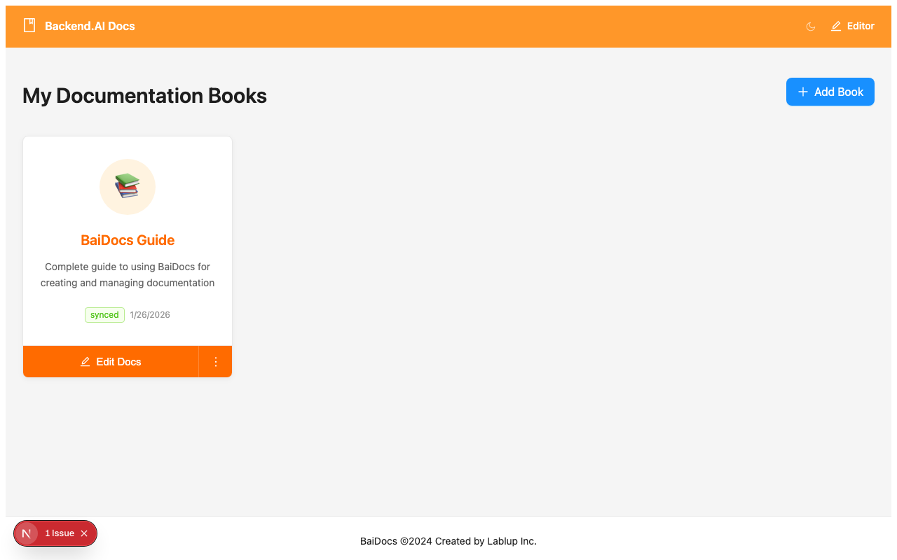

# 설치

몇 분 내에 시스템에서 BaiDocs를 실행할 수 있습니다.

## 전제 조건

BaiDocs를 설치하기 전에 다음이 필요합니다:

- **Node.js** 18.0 이상
- 버전 제어를 위한 **Git**
- **pnpm** (권장) 또는 npm/yarn

## 설치 방법

### 방법 1: GitHub에서 복제 (권장)

시작하는 가장 쉬운 방법은 공식 BaiDocs 저장소를 복제하는 것입니다:

```bash
# 저장소 복제
git clone https://github.com/lablup/baidocs.git
cd baidocs

# 종속성 설치
pnpm install

# 개발 서버 시작
pnpm dev
```

다음과 같이 두 애플리케이션이 시작됩니다:
- **에디터**: http://localhost:3001
- **뷰어**: http://localhost:3000

### 방법 2: 템플릿으로 사용

BaiDocs를 템플릿으로 사용하여 새 저장소를 생성할 수 있습니다:

1. [https://github.com/lablup/baidocs](https://github.com/lablup/baidocs) 방문
2. "Use this template" → "Create a new repository" 클릭
3. 새 저장소를 복제하고 종속성을 설치

```bash
git clone https://github.com/your-username/your-docs.git
cd your-docs
pnpm install
pnpm dev
```

## 개발 스크립트

BaiDocs는 여러 편리한 스크립트를 제공합니다:

```bash
# 개발 (두 앱 모두 시작)
pnpm dev

# 에디터만 시작
pnpm dev:editor

# 뷰어만 시작
pnpm dev:viewer

# 프로덕션 빌드
pnpm build

# 에디터 빌드
pnpm build:editor

# 뷰어 빌드
pnpm build:viewer
```

## 설치 확인

개발 서버를 시작한 후 모든 것이 작동하는지 확인합니다:

### 1. 에디터 확인

**http://localhost:3001**을 방문하면 다음을 볼 수 있습니다:



에디터 홈페이지는 사용 가능한 모든 책을 표시하고 다음 옵션을 제공합니다:
- 새 책 생성
- 기존 저장소 복제
- 다른 문서 도구에서 가져오기

### 2. 뷰어 확인

**http://localhost:3000**을 방문하면 다음을 볼 수 있습니다:


뷰어는 다음과 같은 공개 문서 사이트를 표시합니다:
- 게시된 모든 책 목록
- 검색 기능
- 언어 전환
- 반응형 디자인

## 설정

BaiDocs는 기본 설정으로 작동하지만 사용자 정의할 수 있습니다:

### 환경 변수

앱 디렉토리에 `.env.local` 파일을 생성합니다:

```bash
# apps/editor/.env.local
NEXT_PUBLIC_APP_NAME="Your Docs Editor"

# apps/viewer/.env.local
NEXT_PUBLIC_APP_NAME="Your Documentation"
NEXT_PUBLIC_GITHUB_URL="https://github.com/your-org/docs"
```

### 콘텐츠 디렉토리

기본적으로 BaiDocs는 `content/` 디렉토리에서 콘텐츠를 찾습니다. 다음을 수행할 수 있습니다:

- 하위 디렉토리를 생성하여 새 책 추가
- 팀에게 맞는 방식으로 책 구성
- 개별 책에 Git 저장소 사용

## 문제 해결

### 포트 충돌

3000 또는 3001 포트가 사용 중인 경우:

```bash
# 사용자 정의 포트 사용
pnpm dev:editor --port 3002
pnpm dev:viewer --port 3003
```

### 권한 문제

macOS/Linux에서 권한을 설정해야 할 수 있습니다:

```bash
chmod +x scripts/*.sh
```

### 종속성 문제

종속성 문제가 발생하면:

```bash
# node_modules 정리 후 재설치
rm -rf node_modules apps/*/node_modules
pnpm install
```

### Git 문제

Git이 올바르게 설정되어 있는지 확인합니다:

```bash
git config --global user.name "Your Name"
git config --global user.email "your.email@example.com"
```

## 다음 단계

BaiDocs가 설치되었으므로:

1. **[첫 번째 책 생성](first-book.mdx)** - 문서 구축을 시작합니다
2. **[에디터 탐색](../books/creating-books.mdx)** - 인터페이스를 학습합니다
3. **[콘텐츠 작성](../writing/markdown-basics.mdx)** - MDX 문법을 마스터합니다

## 개발 설정

BaiDocs를 수정하려는 기여자나 고급 사용자를 위한 설정입니다:

### 저장소 구조

```
baidocs/
├── apps/
│   ├── editor/         # 에디터 Next.js 앱
│   └── viewer/         # 뷰어 Next.js 앱
├── packages/
│   └── ui/            # 공유 구성 요소
├── content/           # 샘플 문서
└── scripts/           # 빌드 및 유틸리티 스크립트
```

### 기여

1. 저장소를 포크합니다
2. 기능 브랜치를 생성합니다
3. 변경사항을 작성합니다
4. 철저히 테스트합니다
5. 풀 리퀘스트를 제출합니다

### 소스에서 빌드

```bash
# 전체 개발 빌드
pnpm build

# 개발용 감시 모드
pnpm dev

# 테스트 실행
pnpm test
```

---

*설치가 완료되었습니다! BaiDocs로 훌륭한 문서를 생성할 준비가 되었습니다.*