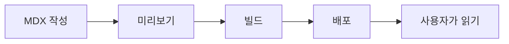

# BaiDocs란 무엇인가?

BaiDocs는 Next.js와 React로 구축된 **현대적인 문서화 프레임워크**로, 아름다운 기술 문서를 쉽게 작성, 관리, 게시할 수 있게 해줍니다.

## BaiDocs가 해결하는 문제

좋은 문서를 만드는 것은 어렵습니다. 기존 문서화 도구들은 종종 다음과 같은 문제를 겪습니다:

- 🚫 **복잡한 설정** - 너무 많은 설정 파일과 의존성
- 🚫 **제한적인 커스터마이징** - 수정하기 어려운 고정된 테마
- 🚫 **열악한 개발자 경험** - 불편한 에디터와 느린 빌드 시간
- 🚫 **벤더 종속** - 콘텐츠를 가두는 독점 포맷

BaiDocs는 이 모든 문제를 해결합니다.

## BaiDocs의 접근 방식

BaiDocs는 다음과 같은 핵심 원칙으로 구축되었습니다:

### 1. 콘텐츠 우선

콘텐츠는 완전히 소유하는 **일반 Markdown/MDX 파일**로 저장됩니다. 독점 포맷도, 데이터베이스도, 종속성도 없습니다.

```markdown
# 당신의 콘텐츠
그냥 마크다운으로 작성하세요. 정말 간단합니다.
```

### 2. 강력하면서도 단순함

BaiDocs는 MDX를 사용하므로 다음을 얻을 수 있습니다:

- 마크다운의 모든 단순함
- 필요할 때 React 컴포넌트의 강력함
- 구문 강조, 테이블, 어드모니션 등

### 3. 현대적인 스택

최첨단 기술로 구축됨:

| 기술 | 목적 |
|------|------|
| **Next.js 15** | App Router를 사용하는 React 프레임워크 |
| **React 19** | UI 라이브러리 |
| **TypeScript** | 타입 안정성 |
| **pnpm** | 빠르고 효율적인 패키지 관리 |
| **Ant Design** | 아름다운 UI 컴포넌트 |

### 4. 유연한 아키텍처

BaiDocs는 두 개의 주요 애플리케이션으로 구성됩니다:

```
BaiDocs
├── 📝 에디터 (포트 3001)
│   └── WYSIWYG 편집 인터페이스
└── 👁️ 뷰어 (포트 3000)
    └── 아름다운 문서 웹사이트
```

## 주요 개념

### 북(Books)

BaiDocs에서 문서는 **북**으로 구성됩니다. 각 북은:

- 자체 디렉토리에 존재
- 독립적인 설정을 가짐
- 여러 언어 지원 가능
- 별도로 버전 관리 가능

### 콘텐츠 디렉토리

모든 북은 `content/` 디렉토리에 있습니다:

```
content/
├── my-api-docs/
├── user-guide/
└── developer-handbook/
```

### 설정

각 북은 간단한 YAML 설정을 가집니다:

```yaml
id: my-book
title: 내 멋진 문서
languages:
  - en
  - ko
```

:::note
BaiDocs는 GitBook, Sphinx, MkDocs 및 기타 인기있는 포맷에서 문서를 가져올 수 있습니다!
:::

## 작동 방식

BaiDocs 워크플로우:

1. **작성** - Markdown/MDX 파일로 콘텐츠 생성
2. **미리보기** - 핫 리로드로 변경사항을 즉시 확인
3. **빌드** - 검색 인덱스와 PDF가 포함된 정적 사이트 생성
4. **배포** - 어디든 호스팅 (Vercel, Netlify, 자체 서버)



:::warning
Mermaid 다이어그램은 현재 버전에서 코드 블록으로 표시됩니다. 다이어그램 렌더링 지원은 향후 릴리스에서 계획되어 있습니다.
:::

## BaiDocs의 특별한 점

### 🎨 기본적으로 아름다움

즉시 전문적으로 보이는 신중하게 제작된 테마가 함께 제공됩니다.

### ⚡ 초고속

정적 사이트 생성은 문서가 즉시 로드됨을 의미합니다.

### 🔍 강력한 검색

빌드 타임 검색 인덱스와 퍼지 매칭. 외부 서비스가 필요 없습니다.

### 📄 PDF 내보내기

빌드 중 문서의 PDF를 자동으로 생성합니다.

### 🌍 다국어

다국어 문서에 대한 일급 지원.

### 🎭 테마 시스템

기본 제공 테마 중에서 선택하거나 CSS 변수로 자신만의 테마를 만드세요.

## 다른 도구와의 비교

| 기능 | BaiDocs | GitBook | Docusaurus | MkDocs |
|------|---------|---------|------------|--------|
| **오픈소스** | ✅ | ❌ | ✅ | ✅ |
| **MDX 지원** | ✅ | ❌ | ✅ | ❌ |
| **WYSIWYG 에디터** | ✅ | ✅ | ❌ | ❌ |
| **PDF 내보내기** | ✅ | ✅ (유료) | ❌ | ✅ |
| **자체 호스팅** | ✅ | ✅ (유료) | ✅ | ✅ |
| **테마 시스템** | ✅ | ❌ | ✅ | ✅ |

## 실제 사용 사례

### API 문서

코드 예제와 인터랙티브 요소가 포함된 REST API, SDK 및 라이브러리 문서화에 완벽합니다.

### 사용자 가이드

스크린샷, 비디오 및 단계별 지침이 포함된 포괄적인 사용자 가이드를 만드세요.

### 내부 위키

검색 및 다국어 지원이 있는 팀을 위한 내부 지식 베이스를 구축하세요.

### 강좌 자료

오프라인 읽기를 위한 PDF 내보내기 기능이 있는 적절한 구조의 교육 콘텐츠를 개발하세요.

## 아키텍처 개요

BaiDocs는 pnpm 워크스페이스를 사용하는 모노레포 구조를 사용합니다:

```
baidocs/
├── apps/
│   ├── editor/    # 편집 애플리케이션
│   └── viewer/    # 문서 뷰어
├── packages/
│   ├── ui/        # 공유 컴포넌트
│   └── config/    # 설정 유틸리티
└── content/       # 문서 북
```

:::success
BaiDocs의 각 부분은 모듈화되고 유지보수가 쉽도록 설계되어 기여하고 확장하기 쉽습니다.
:::

## 다음 단계

이제 BaiDocs가 무엇인지 이해했으니, [주요 기능](key-features.md)을 더 자세히 살펴보겠습니다.
